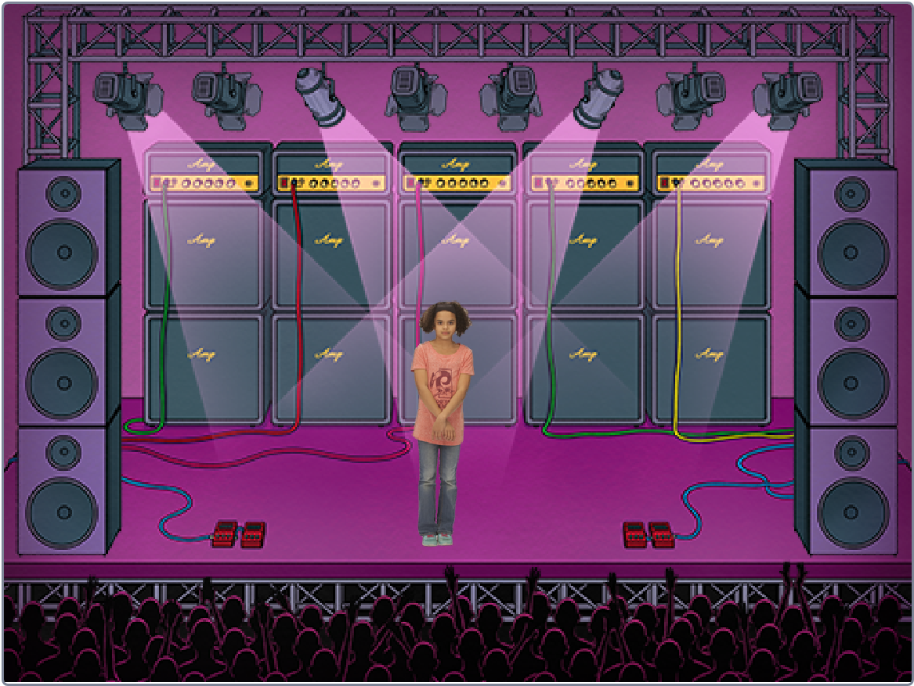

## Introduction

Add project description here. What will learners be making?

### What you will make

--- no-print ---
Click the green flag then type numbers to store dance moves. Press space to start the sprite dancing.

<iframe src="https://scratch.mit.edu/projects/342753697/embed" allowtransparency="true" width="485" height="402" frameborder="0" scrolling="no" allowfullscreen></iframe>
--- /no-print ---

--- print-only ---

--- /print-only ---

--- collapse ---

---
title: What you will need
---

### Hardware

+ A computer capable of running Scratch

### Software

+ Scratch 3 (either [online](http://rpf.io/scratchon){:target="_blank"} or [offline](http://rpf.io/scratchoff){:target="_blank"})

### Downloads

The starter project can be found [here](http://rpf.io/p/en/dance-go){:target="_blank"}.

--- /collapse ---

--- collapse ---

---
title: What you will learn
---

+ How to add items to a list
+ How to iterate over a list

--- /collapse ---

--- collapse ---
---
title: Additional information for educators
---

--- no-print ---

If you need to print this project, please use the [printer-friendly version](https://projects.raspberrypi.org/en/projects/dance/print){:target="_blank"}.

--- /no-print ---

You can find the [completed project here](http://rpf.io/p/en/dance-get){:target="_blank"}.

--- /collapse ---
