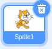
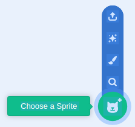
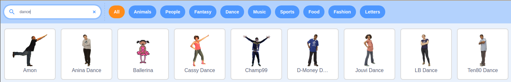

## Make a sprite dance

Begin by choosing a sprite that will be dancing on your stage.

--- task ---
Delete the cat sprite by clicking on the bin icon in the top right corner of the sprite.


--- /task ---

--- task ---
Choose a new sprite by clicking on the `Choose a Sprite` button.


--- /task ---

--- task ---
Search for a sprite by typing in `dance` into the search box.



This resource will use the `Jouvi Dance` sprite


--- /task ---

--- task ---
Use key presses to change the sprite's costume. Start with just presses of `1` and `2`.

```blocks3
when [1 v] key pressed
switch costume to (jo stance v)

when [2 v] key pressed
switch costume to (jo top stand v)
```
--- /task ---

--- task ---
Press the keys `1` and `2` and your sprite's costume should change.
--- /task ---
