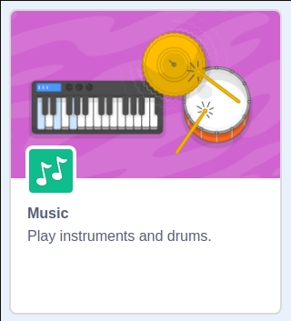

## Add some beats

Now you need to add some drum beats to accompany your dance moves.

--- task ---
Click the `add extension` button in the bottom left hand corner of the screen.


Choose the `music` extension.


--- /task ---

--- task ---
Add `play drum`{:class="block3music"} blocks to each of the scripts to play different drum beats when the sprite's costume changes.

```blocks3
when [1 v] key pressed
switch costume to (jo stance v)
play drum [(1) Snare Drum v] for (0.25) beats

when [2 v] key pressed
switch costume to (jo top stand v)
play drum [(2) Bass Drum v] for (0.25) beats
```
--- /task ---
