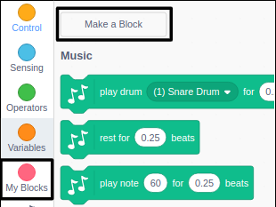
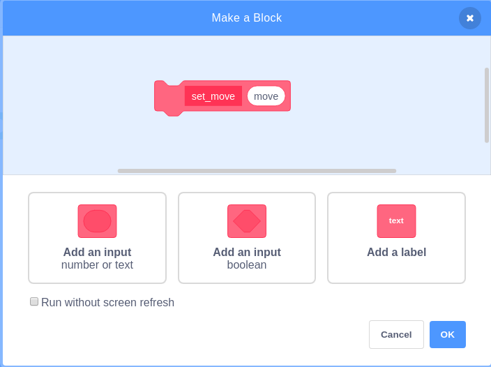
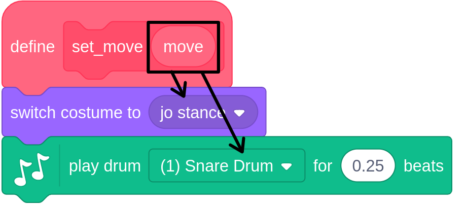

## More moves

It's time to add more dance moves to your project. It would be a little time consuming to set individual costumes and drum beats for each and every key press though. This is where `custom blocks` can help

--- task ---
Click on `My Blocks` and the `Make a Block`


--- /task ---

--- task ---
Call the block `set_move` and add add a number or text input that you can call `move`


--- /task ---

--- task ---
You can now use this block to set the costume and the drum beat to be played.

```blocks3
define set_move (move)
switch costume to (jo stance v)
play drum [(1) Snare Drum v] for (0.25) beats
```
--- /task ---

--- task ---
By dragging the `move` variable down into the `switch costume`{:class="block3looks"} and `play drum`{:class="block3music"} blocks, both the costume and drum beat can be chosen by the custom block.



```blocks3
define set_move (move)
switch costume to (move)
play drum (move) for (0.25) beats
```
--- /task ---

--- task ---
Now you can alter your previous two scripts to use this new block.

```blocks3
when [1 v] key pressed
set_move (1)

when [2 v] key pressed
set_move(2)
```
--- /task ---

--- task ---
To finish off this section, add in more scripts that respond key presses 3 to 9 and 0.

```blocks
when [3 v] key pressed
set_move (3)

when [0 v] key pressed
set_move (4)
```
--- /task ---
