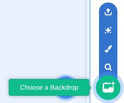
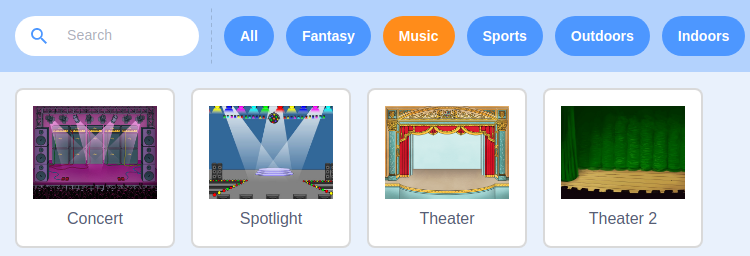

## Improving the look

In this step, you're going to improve the look of the project a little.

--- task ---
First, choose a backdrop for the project, by clicking on `Choose a Backdrop`



You might find a good one in the `music` section.


--- /task ---

--- task ---
Now use a new script to set your sprites size, and then position it on the backdrop. You might have to experiment with different values for the percentage. Make sure you're adding this script to your dancer sprite, and not the backdrop.

```blocks3
when flag clicked
set size to (50) %
```
--- /task ---
