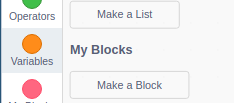
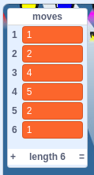

## Storing the moves

In this step you're going to alter the project so that the dance moves you key in will be stored. This will allow them all to be played back together.

--- task ---
Create a new list, by clicking on `Variables`{:class="block3data"} and then clicking on `Make a List`



Call the list `moves`
--- /task ---

--- task ---
Now you are going to alter your custom block, to add the `move`{:class="block3custom"} variable into the list so that the list grows, each time a key is pressed.

```blocks3
define set_move (move)
switch costume to (jo stance v)
play drum [(1) Snare Drum v] for (0.25) beats
add (move) to [moves v]
```
--- /task ---

--- task ---
Now try pressing on a few numbers and you should see them being added into the list.


--- /task ---

--- task ---
It would be nice if the list could be emptied by the user.
Add the following code so that the list is emptied when the `x` key is pressed.

```blocks3
when [x v] key pressed
delete all of [moves v]
```
--- /task ---

--- task ---
To finish off this section, can you make it so that when the `d` key is pressed, the last item in the list is removed, so that if the user accidently presses the wrong key, then they can undo their mistake?

--- hints --- --- hint ---
The position of the last item in the list is going to be the length of the list. So for a list that is 6 items long, the last item is the 6th item.
--- /hint --- --- hint ---
Here are the blocks you will need to use.
```blocks3
when [d v] key pressed
length of [moves v]
delete (1) of [moves v]
```
--- /hint --- --- hint ---
Here is the finished script.
```blocks3
when [d v] key pressed
delete (length of [moves v]) of [moves v]
```
--- /hint --- --- /hints ---
--- /task ---
