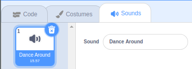

## Finishing off

Now it's time to add some music and light effects to your project.

--- task ---
Begin by showing and emptying the `moves`{:class="block3variables"} list when `flag clicked`{:class="block3events"}.

```blocks3
when flag clicked
set size to (50) %
+ show list [moves v]
+ delete all of [moves v]
```
--- /task ---

--- task ---
Now you want some music to be playing while the sprite dances.

```blocks3
when [space v] key pressed
forever
play sound [Dance around v] until done
```

You can choose different sound track in the `Sounds` tab


--- /task ---

--- task ---
Lastly you need the music to stop when the sound has been played, so add a `stop all`{:class="block3control"} into your script.

```blocks3
when [space v] key pressed
hide list [moves v]
set [position v] to (1)
repeat (length of [moves v])
switch costume to (item (position) of [moves v])
play drum (position) for (0.5) beats
change [position v] by (1)
end
stop [all v]
```
--- /task ---

